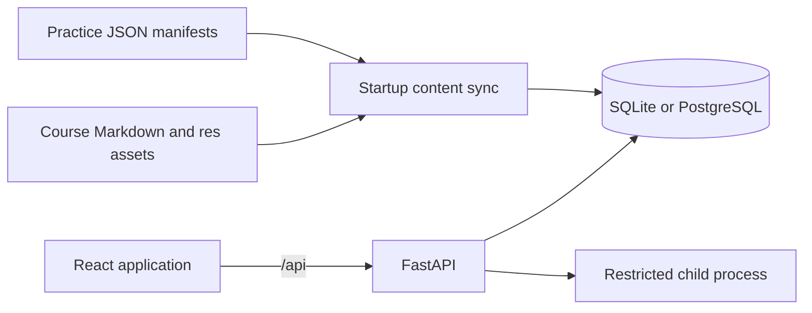
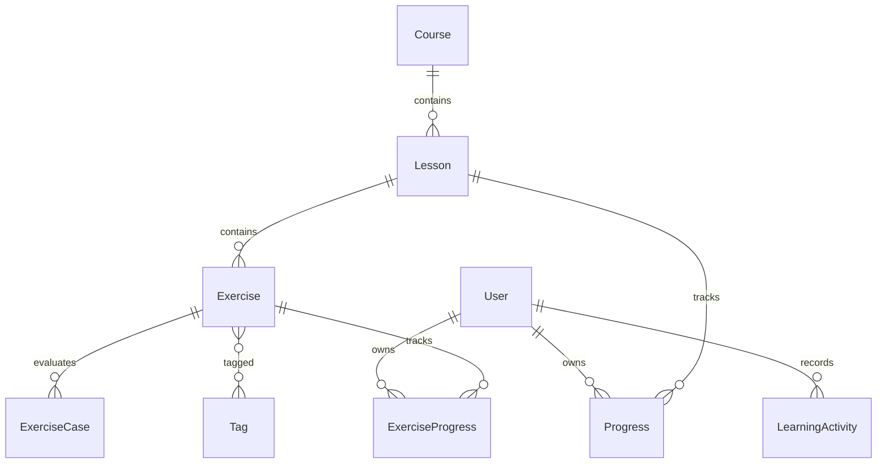

# 架构说明

## 系统概览

PyTrail 是一个单页 React 应用和一个 FastAPI 服务组成的单体仓库。数据库保存用户、同步后的课程目录和学习进度；原始课程 Markdown 与练习 JSON 清单保存在仓库中。

开发环境中，浏览器只访问 Vite 的 5173 端口，Vite 将 `/api` 转发到 8000。生产环境可以由反向代理提供静态前端并把 `/api` 转发到 FastAPI，也可以通过 `PYTRAIL_STATIC_DIR` 让 FastAPI 托管构建产物；两种方式都应由 HTTPS 反向代理保护。

## 运行时组件

### 前端

- `frontend/src/main.tsx`：应用壳、登录、课程目录、课程阅读器和顶层路由衔接。
- `frontend/src/practice/`：独立题库、练习路由、CodeMirror 工作台和运行结果。
- `frontend/src/markdown.tsx`：清洗后的 Markdown、代码高亮、图片路径、课时链接、KaTeX 数学公式和 Mermaid。
- `frontend/src/theme.ts`：系统偏好、持久化主题和 Mermaid 主题同步。
- `frontend/src/api.ts`：统一 API 基础路径、JWT 请求头和错误转换。

主要浏览器路由：

| 路由 | 责任 |
| --- | --- |
| `/` | 课程概览与阅读器，由页面内部 tab 控制当前视图 |
| `/practice` | 独立题库，筛选与分页写入 URL search params |
| `/practice/:slug` | 独立题目工作台 |

课程和课时正文按需请求。练习路由不应为了展示题库而请求课程详情或课时正文。

### 后端

- `backend/app/main.py`：FastAPI 生命周期和 HTTP 端点。
- `backend/app/course_sync.py`：课程发现、内容摘要、内部链接索引和事务同步。
- `backend/app/practice_manifest.py`：练习清单解析与完整性校验。
- `backend/app/practice_service.py`：题库筛选、详情序列化和原子进度 upsert。
- `backend/app/progress_service.py`：课时进度的方言原子 upsert（SQLite / PostgreSQL）。
- `backend/app/activity_service.py`：成功学习活动的原子去重写入和活动日期查询。
- `backend/app/dashboard_service.py`：今日任务、最近 7 天活动与连续学习天数计算。
- `backend/app/practice_feedback.py`：把运行结果归类为稳定的前端反馈类型。
- `backend/app/practice_runner.py`：主进程校验、子进程调度、超时和协议边界。
- `backend/app/practice_worker.py`：RestrictedPython 执行与案例比较。
- `backend/app/models.py`：SQLAlchemy 数据模型。
- `backend/app/auth.py`：密码哈希、JWT 和强密钥策略。

## 启动同步

FastAPI lifespan 在接受请求前执行以下流程：

1. 普通生产模式校验不能使用已知默认 `SECRET_KEY`；`PYTRAIL_USERLESS_MODE` 下没有用户/JWT，跳过这项校验。
2. 创建当前 SQLAlchemy metadata 中缺失的数据表。
3. 读取 9 门课程的 Markdown、资源目录和 9 份练习清单，并在内存中计算资源摘要。
4. 在内存中完成路径、命名、数量、JSON 合约和跨文件唯一性校验；课程相对 Markdown 链接只索引已发现目标，未命中的链接不会让同步失败。
5. 将清单与数据库当前目录逐字段比较。
6. 课程字段、Markdown 和练习字段完全一致时只构建内存 `ContentIndex`，不写数据库。当前资源摘要没有持久化到课程表，也不参与一致性比较。
7. 有差异时，在单个事务内清空课程进度、练习进度、学习活动和目录数据，重建课程、课时、题目、案例与标签，保留用户账号。
8. 生成课时链接映射和课程资源根目录索引。

这不是增量迁移系统。课程或练习内容变化会清空 `progress`、`exercise_progress` 与 `learning_activities`，数据库 ID 也可能变化。稳定外部标识是课程 slug、练习 slug 和逻辑课时 `source_path`。

## 核心数据模型

`Exercise.kind` 区分两种业务：

- `quick_check`：课程阅读页中的短答案速测；
- `function`：练习场中的函数实现题。

两类题共享所有权模型，但使用不同 API、响应字段和进度模型。函数题的 `starter_code` 永远是官方模板；用户保存代码位于 `ExerciseProgress.last_code`。函数题的三层提示直接保存在 `Exercise.hints` JSON 字段，当前 schema 不维护旧数据库兼容层。

`LearningActivity` 使用 `(user_id, activity_date, kind, source_key)` 唯一约束。`activity_date` 是 UTC 日历日，`source_key` 使用课时 `source_path` 或练习 slug 等稳定来源标识。只有完成课时、答对速测、通过函数题这三类成功行为会在进度事务内写入活动；失败和无用户模式不写。同一天重复完成同一来源不会重复计数，但不同来源都可保留。

## 主要请求流

### 课程阅读

1. `GET /api/courses` 返回轻量课程摘要。
2. 选择课程后，`GET /api/courses/{id}` 返回课时摘要，不包含 Markdown。
3. 选择课时后，`GET /api/lessons/{id}` 返回 Markdown、速测、资源基础 URL、内部课时链接和 `practice_count`。
4. 前端使用 sanitized renderer 展示正文，并将已索引的 Markdown 课时链接转换为应用内导航。

`GET /api/config` 只返回非敏感的部署能力标志（当前为 `userless_mode`），供静态前端决定是否展示用户功能。`GET /api/health` 返回 API 存活状态和服务名，不代表内容同步或练习 worker 一定可用。

### 练习场

1. `GET /api/practice/exercises` 返回公开题库、筛选 facets 和可选登录进度。
2. `GET /api/practice/exercises/{slug}` 返回题面、签名、官方模板、三层提示、公开案例和可选 `progress.last_code`。
3. 前端使用最近代码初始化编辑器；没有进度时使用官方模板。
4. 标准模式下登录用户调用 `POST /api/practice/exercises/{slug}/run`；无用户模式（`PYTRAIL_USERLESS_MODE=1`/`true`/`yes`/`on`）允许匿名调用，并始终返回空进度。
5. API 校验请求并启动隔离子进程执行全部公开案例。
6. 标准模式只有获得正常练习结果时才原子更新尝试次数、最近代码和状态；通过时在同一事务记录有效学习活动。无用户模式始终返回空进度并跳过写入。基础设施 `503` 不写进度。
7. 已通过状态不会被后续失败运行降级。
8. API 将结果归类为 `all_passed`、`wrong_output`、`runtime_error` 或 `validation_error`，前端据此展示方向性反馈，并允许三层提示逐次揭示。

### 学习闭环

登录用户的 `GET /api/dashboard` 返回原有完成率与平均分，并增加：

- `streak`：截至当前 UTC 日期的连续有效学习天数；
- `recent_activity`：最近 7 天内有有效活动的 ISO 日期；
- `today_task`：按“继续未通过练习、下一未完成课时、未开始练习、最早需要复习的已通过练习”选择的一项任务。

前端对 dashboard 使用独立的 loading、error、retry、取消和过期响应保护。今日任务可直接导航到对应课时或练习；完成速测或运行函数题后会刷新 dashboard。无用户模式隐藏整套个性化界面。

### 身份认证

注册和登录返回 7 天有效的 HS256 JWT。前端保存在 `localStorage.pytrail_token`，统一 API 客户端通过 Bearer header 发送。公开练习接口使用可选认证，因此登录用户能在相同响应中获得自己的进度。认证注册和登录分别按路径与客户端 IP 每 60 秒最多 5 次；练习运行按用户/IP 每 60 秒最多 20 次，限流状态只保存在单进程内存。无用户模式禁用注册、登录、用户详情和 dashboard，忽略旧 token，并关闭所有进度写入。

注册与登录的邮箱会先 trim 再做小写归一化；姓名 trim 后不能为空；姓名、邮箱和密码都有长度上限，密码不 trim。并发重复注册依赖唯一约束返回 409，不产生 500。生产环境的 `SECRET_KEY` 必须是非已知默认值且长度至少 16 字符。

### 课时进度写入

`/api/progress` 与速测提交先校验课时存在，再通过 `progress_service.upsert_lesson_progress` 执行方言特定的 `INSERT ... ON CONFLICT DO UPDATE`，并发首次写入不会触发唯一约束错误。SQLite 连接统一启用 `PRAGMA foreign_keys=ON`，孤儿进度行会被数据库拒绝。

## 代码执行边界

练习代码不在 API 进程中直接执行。主进程先进行 AST 和函数签名校验，再以 `python -I` 启动子进程，通过有大小限制的 UTF-8 JSON stdin/stdout 通信。解释器默认与 API 相同；临时非 Docker 部署可用 `PYTRAIL_PRACTICE_PYTHON` 显式选择本机 Python，但不会因此移除其他限制。

当前边界包括：

- 标准模式的登录要求、无用户模式的 IP 限流，以及两种模式共用的请求限制；
- 12 KB 源码上限；
- 96 KB 输入和输出协议上限；
- 2 秒总超时；
- RestrictedPython builtin 集合；
- 禁止导入、动态求值、文件访问和私有属性遍历；
- 支持平台上的 CPU、内存和文件描述符限制。

在 Windows 上没有 Unix `resource` 限制；在任何平台上，RestrictedPython 也不等同于面向敌对用户的容器级隔离。公网部署应使用专门的沙箱服务。客户端 IP 取 ASGI request 的直接 peer，不信任 `X-Forwarded-For`；反向代理应自行配置真实 IP 处理和全局限流。

## 已知取舍

- 当前数据库 schema 通过 `create_all` 建立，没有 Alembic 迁移链。
- 内容同步采用全量重建，适合当前无生产历史数据阶段。
- 题库规模固定且较小，后端在内存中完成 40 道题的搜索、筛选和分页。
- 所有案例均为公开案例，没有隐藏测试、排行榜、提交历史或多语言运行器。
- `/api/execute` 是旧课程演示入口，默认关闭：开关接受 `1`、`true`、`yes`、`on`，只有显式开启、处于非生产环境且未启用无用户模式时才存在，调用仍需登录。它用 `python -I -c` 直接执行，隔离强度低于练习运行器，仅限本地开发演示，不应对不可信公网用户开放。
