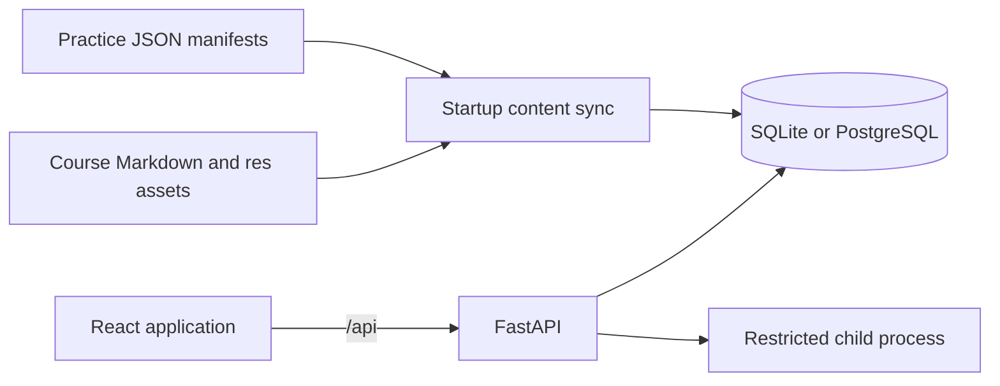
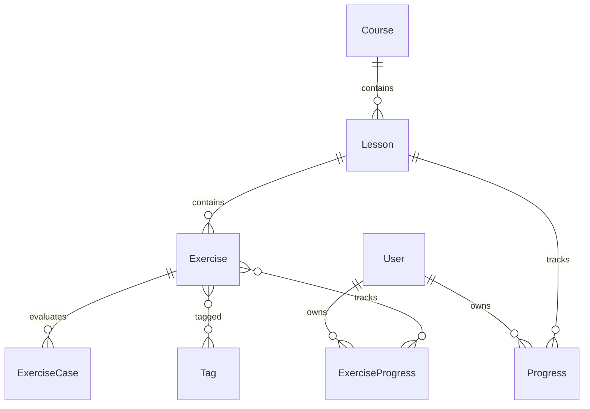

# 架构说明

## 系统概览

PyTrail 是一个单页 React 应用和一个 FastAPI 服务组成的单体仓库。数据库保存用户、同步后的课程目录和学习进度；原始课程 Markdown 与练习 JSON 清单保存在仓库中。

开发环境中，浏览器只访问 Vite 的 5173 端口，Vite 将 `/api` 转发到 8000。生产环境应由反向代理提供静态前端和 HTTPS，并把 `/api` 转发到 FastAPI。

## 运行时组件

### 前端

- `frontend/src/main.tsx`：应用壳、登录、课程目录、课程阅读器和顶层路由衔接。
- `frontend/src/practice/`：独立题库、练习路由、CodeMirror 工作台和运行结果。
- `frontend/src/markdown.tsx`：清洗后的 Markdown、代码高亮、图片路径、课时链接和 Mermaid。
- `frontend/src/theme.ts`：系统偏好、持久化主题和 Mermaid 主题同步。
- `frontend/src/api.ts`：统一 API 基础路径、JWT 请求头和错误转换。

主要浏览器路由：

| 路由 | 责任 |
| --- | --- |
| `/` | 课程概览与阅读器，由页面内部 tab 控制当前视图 |
| `/practice` | 独立题库，筛选与分页写入 URL search params |
| `/practice/:slug` | 独立题目工作台 |

课程和课时正文按需请求。练习路由不应为了展示题库而请求课程详情或课时正文。

### 后端

- `backend/app/main.py`：FastAPI 生命周期和 HTTP 端点。
- `backend/app/course_sync.py`：课程发现、内容摘要、内部链接索引和事务同步。
- `backend/app/practice_manifest.py`：练习清单解析与完整性校验。
- `backend/app/practice_service.py`：题库筛选、详情序列化和原子进度 upsert。
- `backend/app/progress_service.py`：课时进度的方言原子 upsert（SQLite / PostgreSQL）。
- `backend/app/dashboard_service.py`：今日任务、有效学习日和最近活动聚合。
- `backend/app/practice_runner.py`：主进程校验、子进程调度、超时和协议边界。
- `backend/app/practice_worker.py`：RestrictedPython 执行与案例比较。
- `backend/app/models.py`：SQLAlchemy 数据模型。
- `backend/app/auth.py`：密码哈希、JWT 和强密钥策略。

## 启动同步

FastAPI lifespan 在接受请求前执行以下流程：

1. 校验生产环境不能使用已知默认 `SECRET_KEY`。
2. 创建当前 SQLAlchemy metadata 中缺失的数据表。
3. 读取 9 门课程的 Markdown、资源目录和 9 份练习清单，并在内存中计算资源摘要。
4. 在内存中完成路径、命名、数量、JSON 合约和跨文件唯一性校验。
5. 将清单与数据库当前目录逐字段比较。
6. 课程字段、Markdown 和练习字段完全一致时只构建内存 `ContentIndex`，不写数据库。当前资源摘要没有持久化到课程表，也不参与一致性比较。
7. 有差异时，在单个事务内清空学习进度和目录数据，重建课程、课时、题目、案例与标签，保留用户账号。
8. 生成课时链接映射和课程资源根目录索引。

这不是增量迁移系统。课程或练习内容变化会清空 `progress` 与 `exercise_progress`，数据库 ID 也可能变化。稳定外部标识是课程 slug、练习 slug 和逻辑课时 `source_path`。

## 核心数据模型

`Exercise.kind` 区分两种业务：

- `quick_check`：课程阅读页中的短答案速测；
- `function`：练习场中的函数实现题。

两类题共享所有权模型，但使用不同 API、响应字段和进度模型。函数题的 `starter_code` 永远是官方模板；用户保存代码位于 `ExerciseProgress.last_code`。

## 主要请求流

### 课程阅读

1. `GET /api/courses` 返回轻量课程摘要。
2. 选择课程后，`GET /api/courses/{id}` 返回课时摘要，不包含 Markdown。
3. 登录用户的 `GET /api/dashboard` 返回课程统计、有效学习日 streak、最近 7 天活动和一个透明规则生成的今日任务。
4. 选择课时后，`GET /api/lessons/{id}` 返回 Markdown、速测、资源基础 URL、内部课时链接和 `practice_count`。
5. 前端使用 sanitized renderer 展示正文，并将已索引的 Markdown 课时链接转换为应用内导航。

### 练习场

1. `GET /api/practice/exercises` 返回公开题库、筛选 facets 和可选登录进度。
2. `GET /api/practice/exercises/{slug}` 返回题面、签名、官方模板、最多三层提示、公开案例和可选 `progress.last_code`。
3. 前端使用最近代码初始化编辑器；没有进度时使用官方模板。
4. 登录用户调用 `POST /api/practice/exercises/{slug}/run`。
5. API 校验请求并启动隔离子进程执行全部公开案例。
6. 只有获得正常练习结果时才原子更新尝试次数、最近代码和状态；结果同时包含稳定的反馈分类。基础设施 `503` 不写进度。
7. 已通过状态不会被后续失败运行降级。

### 身份认证

注册和登录返回 7 天有效的 HS256 JWT。前端保存在 `localStorage.pytrail_token`，统一 API 客户端通过 Bearer header 发送。公开练习接口使用可选认证，因此登录用户能在相同响应中获得自己的进度。

注册与登录的邮箱会先 trim 再做小写归一化；姓名 trim 后不能为空；姓名、邮箱和密码都有长度上限，密码不 trim。并发重复注册依赖唯一约束返回 409，不产生 500。生产环境的 `SECRET_KEY` 必须是非已知默认值且长度至少 16 字符。

### 课时进度写入

`/api/progress` 与速测提交先校验课时存在，再通过 `progress_service.upsert_lesson_progress` 执行方言特定的 `INSERT ... ON CONFLICT DO UPDATE`，并发首次写入不会触发唯一约束错误。SQLite 连接统一启用 `PRAGMA foreign_keys=ON`，孤儿进度行会被数据库拒绝。

## 代码执行边界

练习代码不在 API 进程中直接执行。主进程先进行 AST 和函数签名校验，再以 `python -I` 启动子进程，通过有大小限制的 UTF-8 JSON stdin/stdout 通信。

当前边界包括：

- 登录要求和每个用户/IP 的速率限制；
- 12 KB 源码上限；
- 96 KB 输入和输出协议上限；
- 2 秒总超时；
- RestrictedPython builtin 集合；
- 禁止导入、动态求值、文件访问和私有属性遍历；
- 支持平台上的 CPU、内存和文件描述符限制。

在 Windows 上没有 Unix `resource` 限制；在任何平台上，RestrictedPython 也不等同于面向敌对用户的容器级隔离。公网部署应使用专门的沙箱服务。

## 已知取舍

- 当前数据库 schema 通过 `create_all` 建立，没有 Alembic 迁移链。
- 内容同步采用全量重建，适合当前无生产历史数据阶段。
- 题库规模固定且较小，后端在内存中完成 36 道题的搜索、筛选和分页。
- 所有案例均为公开案例，没有隐藏测试、排行榜、提交历史或多语言运行器。
- 今日任务使用透明的数据库聚合规则；有效学习日包括课时完成、速测答对和函数练习通过，失败练习不增加 streak。
- `/api/execute` 是旧课程演示入口，默认关闭：只有显式设置 `PYTRAIL_ENABLE_LEGACY_EXECUTE=1` 且环境不是生产时才存在，其余情况返回 404。它用 `python -I -c` 直接执行，隔离强度低于练习运行器，启用仅限本地开发演示，不应对不可信公网用户开放。
